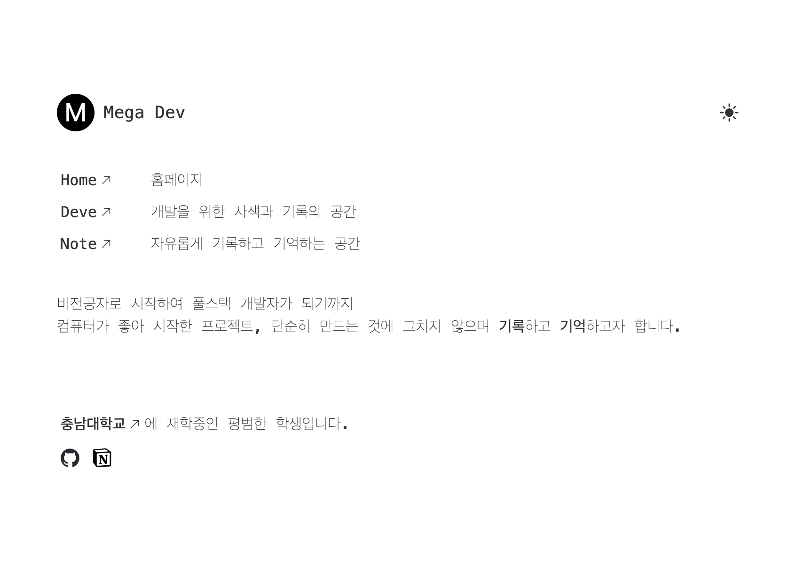
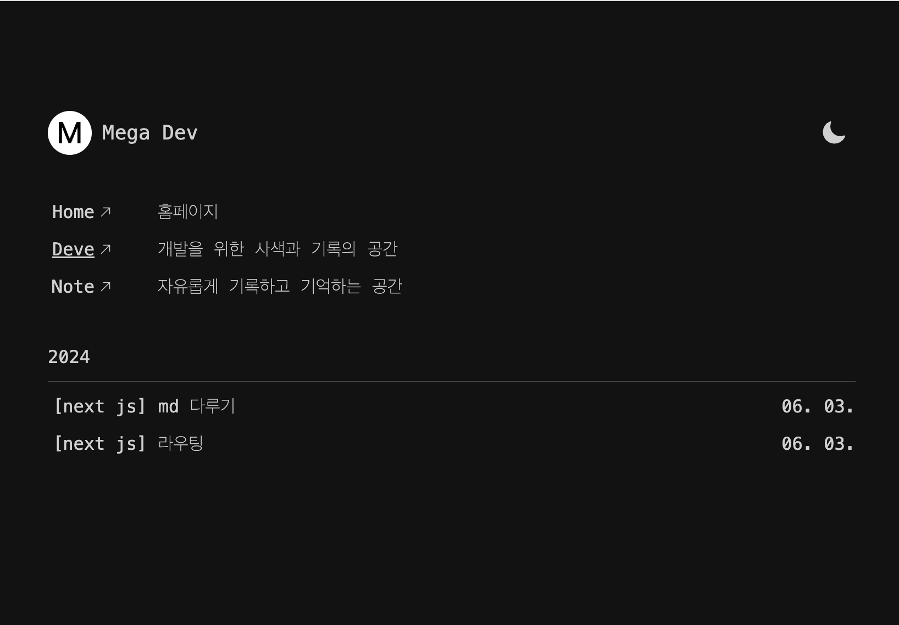
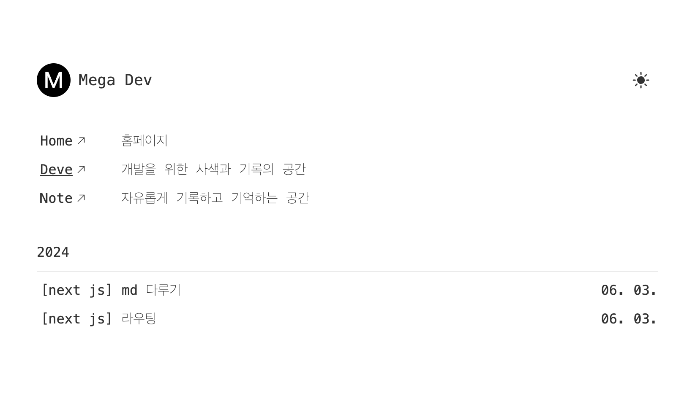
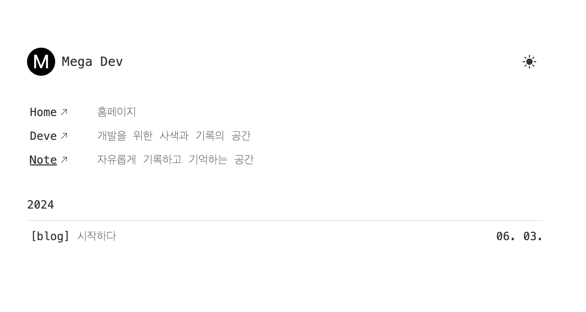

# Mega Dev

### 김선인의 개발공간

나의 개발에 관한 모든 고민과 고찰을 기록하고 기억하기 위한 공간

#### [번외] Dark Mode

- 블로그 최상단에 위치한 태양, 달 로고로 다크모드 전환

- 클릭시 각각 테마에 맞게 최상위 html요소에 dark, light태그를 add한다.

- light와 dark class에 대한 스타일들을 각각 만들어 놓음

- light, dark class가 add됨에 따라 그에 맞는 스타일들이 적용됨

#### 1. Home

- 로고와 블로그 이름, 다크모드

- 페이지 이동을 위한 navigation배치

- 블로그 소개 밑 김선인에 대한 설명.

- 김선인의 github, notion 링크

#### 2. Deve

- 페이지 이동을 위한 navigation배치

- 내가 현재까지 개발하며 발견한 유용한 정보들을 보관하는 공간

- md파일을 통한 페이지 렌더링

#### 3. Note

- 페이지 이동을 위한 navigation배치

- 고민들과 잡다한 정보들을 자유롭게 보관하는 공간

- md파일을 통한 페이지 렌더링
